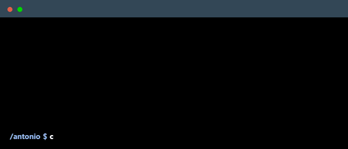

<!-- Terminal GIF can be created here -> https://www.terminalgif.com -->

    

## 🧰 Some of the languages and tools I use

### Languages

### Front-end

### Back-end

### AI

### Other

 
## 📊 Some stats

## 📧 Get in touch with me!

   

